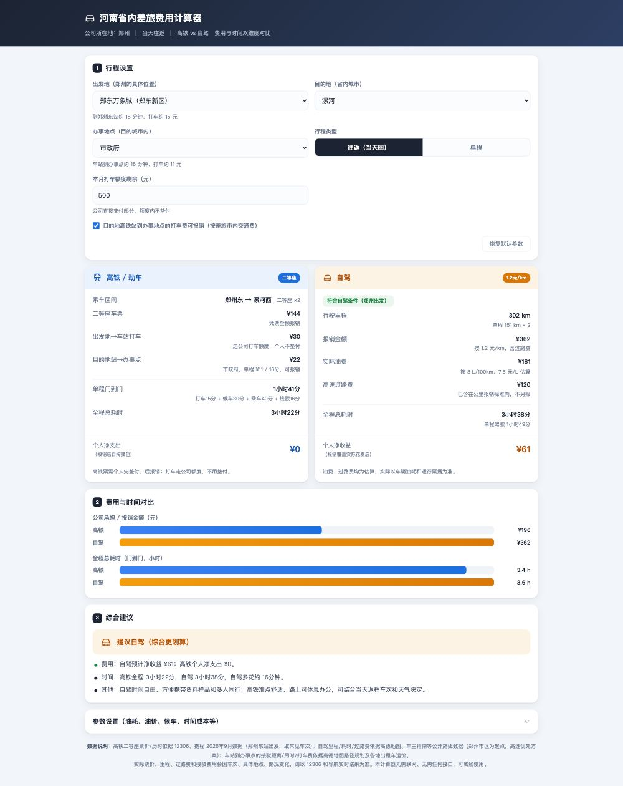
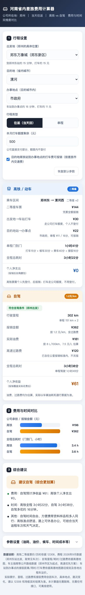

# 河南省内差旅费用计算器（郑州出发）

一个单文件 HTML 小工具：选好目的地和办事地点，**5 秒**算出这趟出差该坐高铁还是自驾。

- 打开即用，**无需安装、无需联网、不接任何大模型接口**，可离线使用
- 电脑端、手机端都能用
- 在线版：`https://johnchow90.github.io/travel-cost-calculator/`
- 单文件下载版：`河南省内差旅费用计算器.html`

## 它算什么

按公司报销规则对比两种方式的**个人净支出**与**时间成本**：

- 高铁：只报二等座，其余（出发地到车站、车站到办事点的打车）按个人支出计入
- 自驾：按 1.2 元/公里报销，高速过路费包含在该标准内、不另报；油费按车辆油耗与油价估算，报销覆盖不了的部分算个人净支出
- 打车额度：四环内出差只能打车，额度由公司直接支付，不计个人成本
- 时间成本：把"每小时的时间值多少钱"折进总成本，再给综合建议

参数区可以按自己的情况改：车辆油耗、油价、候车时间、出发地到东站用时、时间成本单价等。

## 数据说明

> 高铁二等座票价/历时依据 **12306、携程 2026 年 9 月数据**（郑州东站出发，取常见车次）；自驾里程/耗时/过路费依据**高德地图、车主指南等公开路线数据**（郑州市区为起点，高速优先方案）；车站到办事点的接驳距离/用时/打车费依据**高德地图路径规划及各地出租车运价**。
>
> 实际票价、里程、过路费和接驳费用会因车次、具体地点、路况变化，**请以 12306 和导航实时结果为准**。本计算器无需联网、无需任何接口，可离线使用。

工具内另有提示：**油费、过路费均为估算，实际以车辆油耗和通行票据为准。**

## 截图

| 电脑端 | 手机端 |
|-|-|
|  |  |

## 使用许可

本工具**个人使用免费**；**企业内部部署、团队使用、二次分发及任何商业用途，需事先获得作者授权**。
详见 [LICENSE.md](LICENSE.md)。

## 说明

- 报销规则因公司而异，这个计算器按的是作者本人所在公司的标准；换公司使用请直接改 `index.html` 里的规则与基础数据。
- 作者：平野先生（公众号同名）
